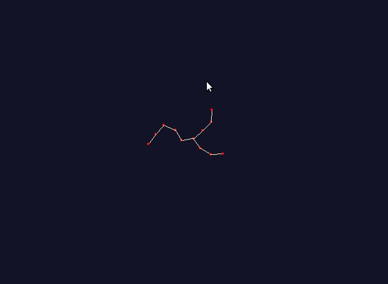

# Rapidly-Exploring-Random-Tree
Simple demo of RRT using pygame interface - Adapted from Steve LaValle's example

The algorithm is as follows:
* Find a random node which is collision free
* Get the nearest vertex
* Calculate an interpolated node at a fixed distance




## Getting started 
Download the repo and run rrt_example.py

## Prerequisites
Install pygame 
```
pip3 install pygame
```
## Acknowledgements
I have used the example from Steve LaValle, who gave the RRT algorithm
